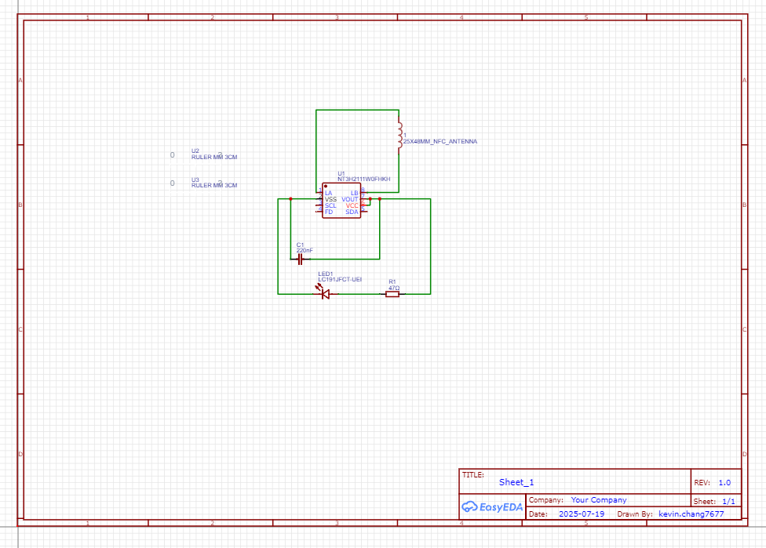
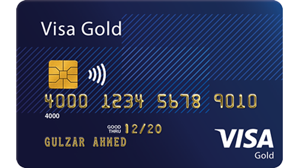
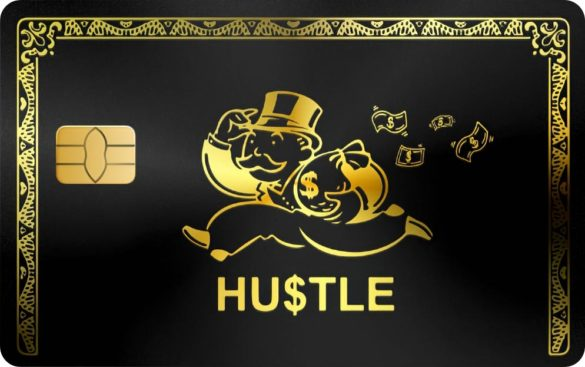
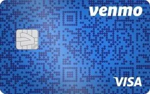
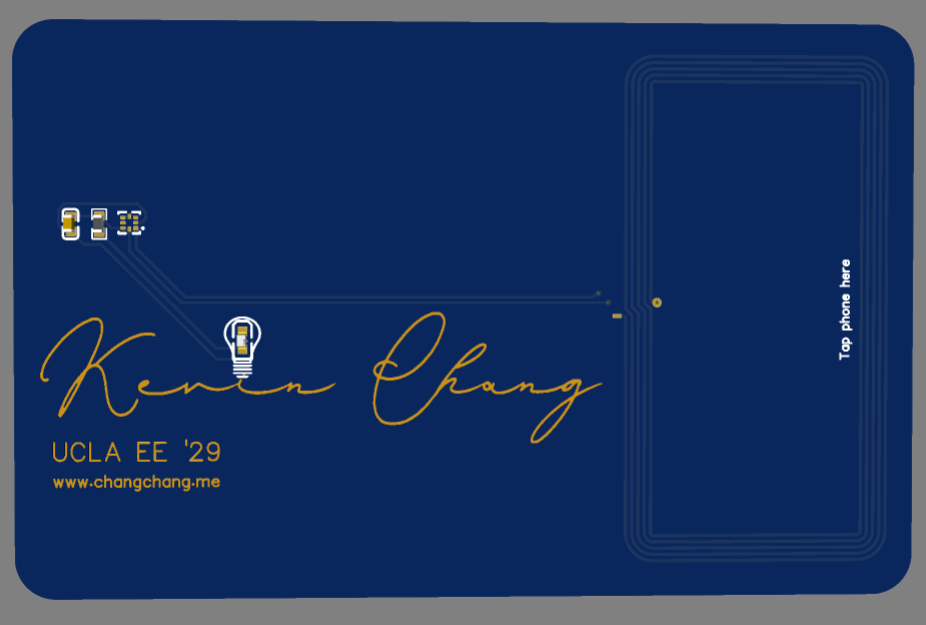
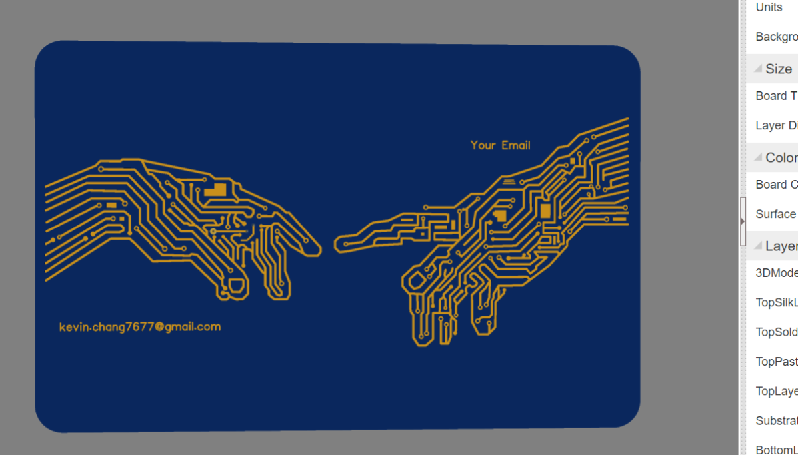
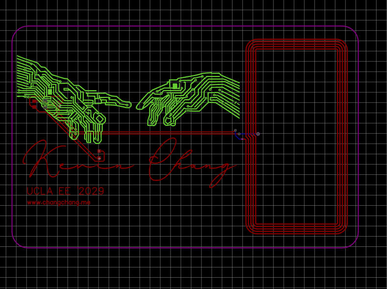
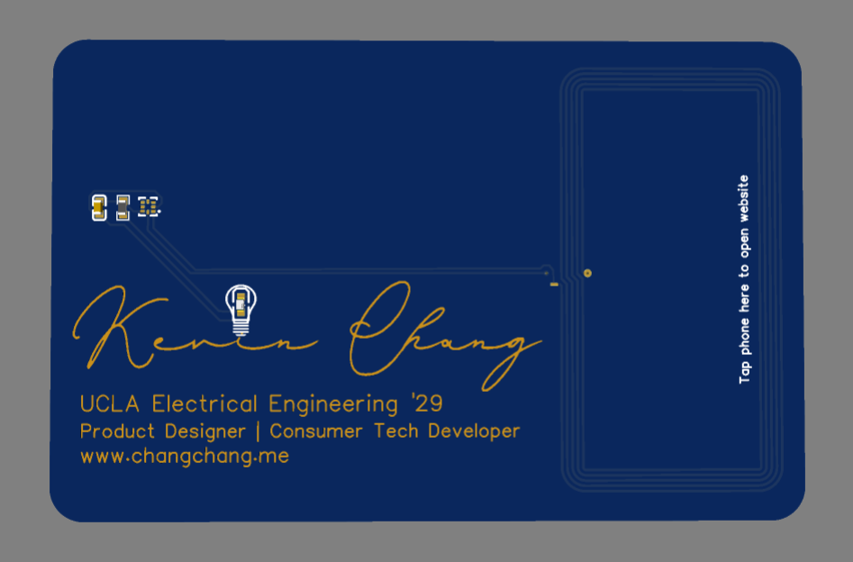
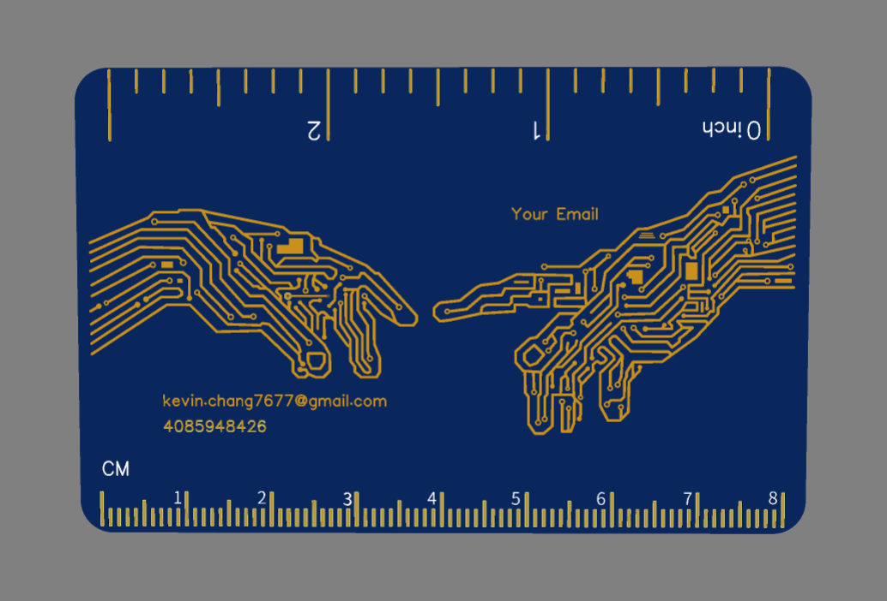
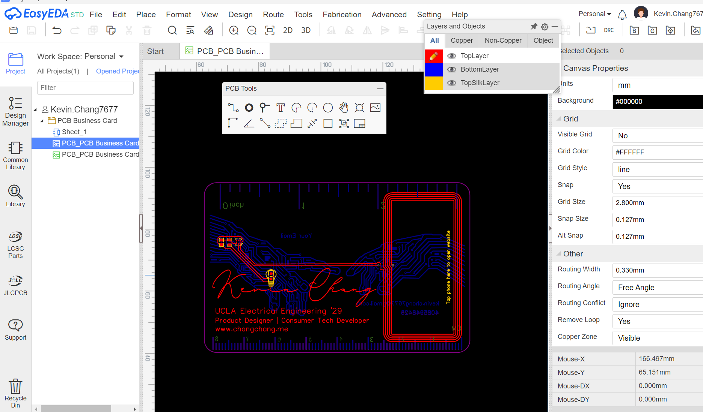

# 7/20: Decided Function & Created Schematic

I decided to create a PCB business card after seeing this youtube video of one guy who made a flappy bird business card (which I thought was insanely cool!). I'm a perfectionist, so I spent a lot of time agonizing over what I should do, after all, I wanted my design not only to impress someone from the get go, look elegant, but to also serve a useful function. I initially wanted to create a game of tic tac toe, but after doing more research I determined that it was a little out of my skillset. After some more digging, I learned about NFC coils, and that seemed like a super cool way to impress someone. Fortunately, I found a tutorial made by Maggie Liu (https://jams.hackclub.com/jam/hacker-card) which proved to be super helpful! I found a golden LED to incorporate into the design because gold is my favorite color. It took a little while to make the schematic because although I had participated in Undercity before this, it was using KiCAD. I was soon pleasantly surprised by the fact that Easy EDA is a lot easier to use (I guess the naming makes sense LOL).

**Total time spent: 1.5 hrs**

# 7/21: Day 1 of Design: Front

I knew immediately that I wanted my design to look really sleek, sort of like a credit card. I found some inspiration from the venmo card, the gold color from the monopoly card, and some other cards. I decided to arrange the footprints of the resistor, capacitor, and nfc chip to match the chip on the credit cards.

Images of my inspo:

I then proceeded to spend a ridiculous amount of time drawing my name in cursive. I also had the idea of using the golden LED as a the dot on my "i" in my name, and toyed a bit with adding an image of a lightbulb around it on the silkscreen. By choosing gold tracing on my PCB and removing the soldermask, I was able to get the classic gold look.
Here is a look at the front of the card:

 

**Total time spent: 2 hrs**

# 7/22: Day 2 of Design: Back

The front was simple and elegant, but I wanted the back to be something that makes someone go "WOW." I spent far more time than I would have liked browsing pinterest for tech art, and I decided to make the creation of adam but with pcb wires. I thought that the juxtaposition between religion and tech would make the design particularly beautiful (feels like I'm writing an essay for English class rn LOL). Then, for the next 4+ hours, I "drew" the creation of adam with the wire tool on Easy EDA. I got the fun idea to put my email next to one hand, and "your email" on the other, like I was reaching out.

Here is the footprint of the full design:

**Total time spent: 5.5 hrs**

# 8/16: Design V2

Between 7/22 and 8/16 I went on a vacation and I got caught up in some other stuff (totally not an excuse for procrastinating trust). I sent out the initial design to some of my friends, and they gave a lot of valuable feedback. I decided to add a 8 cm and 3 inch ruler to the back of my PCB (where the creation of adam resides) because there was some space and because there needed to be more functionality and thus incentive for people to actually keep the business card. I also added my phone number! In the front, I added more detail describing who I am (the product designer part) along with a few other minor changes for better clarity and visibility.

Also to clarify, I am an incoming freshman at UCLA, however I am still 18 (my birthday is on 6/6/2007) which complies with Hack Club rules and which is why I'm applying for the grant (and yes the blue gold coloring of the card is indeed inspired by the UCLA logo!)

Here is a look at the final design!:

**Total time spent: 1h**